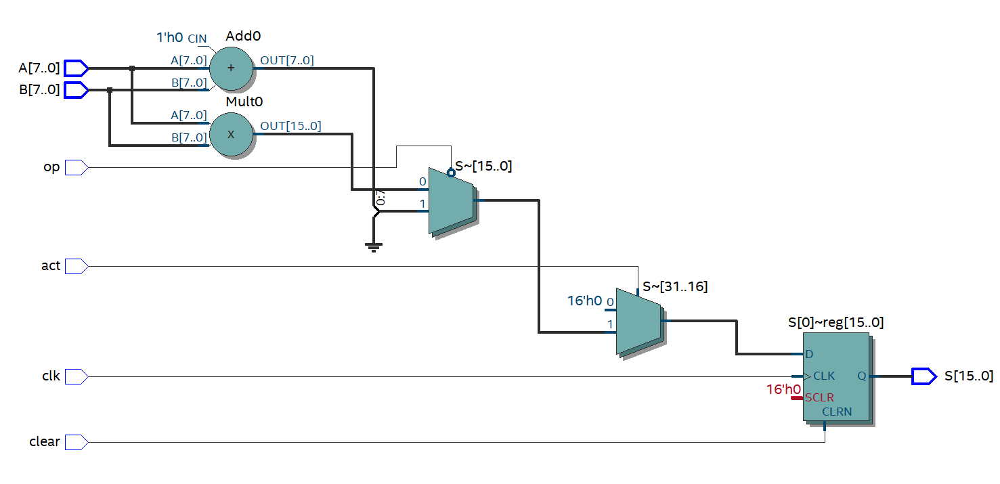
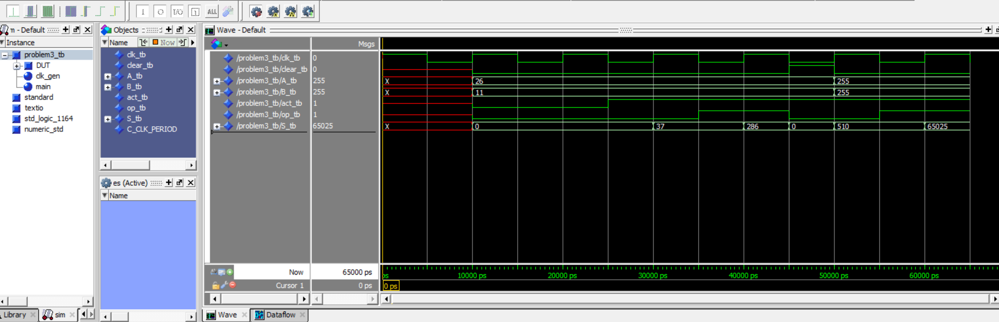

# Testbench

After completing the planning and writing your code you will have to test it on real devices. Before that step it is necessary to test out your code with a testbench to ensure your outputs are what you expect. There are many different fpga testbench apps but today I will show the basics of <b>ModelSim</b>.

I won't explain my vhdl code but it should be in the same folder as this file. Here is a picture of the RTL design of my code created by Quartus Prime. I will create a test bench to this program to test my theoretical outputs.



This code will take 2 inputs and choose between its addition or multiplication depending on the op input. Then it will choose between that output or and output of 0 (depending on the act input) to go in a register which has a asynchronous reset signal which means the reset has a higher priority compared to the clock. The output will be represented in 16 bits and the A an B inputs are 8 bits each

## testbench creation

To start off we will have to create a new vhdl file for our test bench. The first step is to create our entity. In our test bench the entity section is empty, no inputs or outputs.

```vhdl
library ieee;
use ieee.std_logic_1164.all;
use ieee.numeric_std.all;

entity problem_tb is
end entity problem_tb;
```

## Architecture

Now in the architecture section is where most of text goes. All port of of regular vhdl entity will be turned into signals in our test bench. Signals of regular vhdl file does not need to be included in this architecture. Here is an example.

```vhdl
architecture testbench of problem_tb is

    signal clk_tb : std_logic;
	signal clear_tb : std_logic;
	signal A_tb : unsigned(7 downto 0);
	signal B_tb : unsigned(7 downto 0);
	signal act_tb : std_logic;
	signal op_tb : std_logic;
	signal S_tb : unsigned(15 downto 0);
	
	constant C_CLK_PERIOD : time := 10 ns;

begin
```

The `:=` is used to initialize the value of a signal. For the constant clock period we initialize the time to 10 nano seconds.</br>

### Begin

There are 2 main section you have to add after the begin section of the architecture. First of all here is where you define <b>processes</b> which will allow you to test different input values and secondly the <b>DUT</b>(Device under test). The DUT allows us to associates ports on of main file to signal of test bench.

To begin we will have to make a clock cycle. I determined my clock cycle will be 10ns which cycle between values 1 and 0 every 5 ns. Here is how to make a process for a clock cycle.

```vhdl
clk_gen : process
		begin
			clk_tb <= '1';
			wait for C_CLK_PERIOD / 2;
			clk_tb <= '0';
			wait for C_CLK_PERIOD / 2;
		end process clk_gen;
```

You can interchange the values so its starts with 0 and ends with 1.</br>

Now we can configure our main process. I will only show a portion of test i did or this part will get a little too long.

```vhdl
main : process
		begin 
		
				-- act and op 0,0  0
				wait for C_CLK_Period;
				clear_tb <= '0';
				A_tb <= to_unsigned(26 ,8);
				B_tb <= to_unsigned(11 ,8);
				act_tb <= '0';
				op_tb <= '0';
				
				-- act and op 1,0  addition
				wait for C_CLK_PERIOD * 3/2;
				clear_tb <= '0';
				A_tb <= to_unsigned(26 ,8);
				B_tb <= to_unsigned(11 ,8);
				act_tb <= '1';
				op_tb <= '0';
				
				-- act and op 1,1  multiplication
				wait for C_CLK_PERIOD * 1;
				clear_tb <= '0';
				A_tb <= to_unsigned(26 ,8);
				B_tb <= to_unsigned(11 ,8);
				act_tb <= '1';
				op_tb <= '1';
                wait;
```

In other test bench I would also create an extra signal to be a comparison to the output signal to ensure the output is what I intended.</br>

Now we add the DUT. To simplify my job i kept a simple naming scheme. the signals in my test bench are the same as the port in my vhdl entity but i added `_tb` at the end of them. My entity for my main vhdl file is named <b>problem</b>. So with this here is an example of DUT.

```vhdl
DUT : entity work.problem
		port map (
			clear  => clear_tb,
			clk  => clk_tb,
			A => A_tb,
			B => B_tb,
			S => S_tb,
			act => act_tb,
			op => op_tb
		);
```

Just a reminder the DUT isn't in a process. after DUT and process you can end your architecture.

## ModelSim

Now that we are done with writing our test bench we can start testing it with ModelSim. Before we start with the app we will write a script to run ou test bench with one command instead of multiple. Make a blank file that ends with `.do` and add something like this.

```
vdel -all work 
vlib work
vmap work work


vcom -work work problem.vhd
vcom -work work problem_tb.vhd
vsim work.problem_tb
add wave -unsigned *
run 65 ns
wave zoom full
```

<b>vlib work</b> create a library directory named work.</br>
<b>vdel -all work</b> deletes all the content of the work library.</br>
<b>vcom -work work problem.vhd</b> compiles the file in work library.
<b>vsim work.problem_tb</b> starts the simulation with the entity problem_tb.</br>
<b>add wave -unsigned *</b> Tell the system to add each signal to ModelSim as unsigned signals. There exist many options othr than unsigned.</br>
<b>run 65 ns</b> run the simulation for 65 nanoseconds.</br>
<b>wave zoom full</b> adjust the timeline so whole simulation fits on the screen.</br></br>

The order of vcom is important. If a file execution depends on the output of an other, it has to be compiled after the first one. So that's why testbench file will always be compiled last.
Also make sure .do file is in same folder as the project/other vhdl file are in.

After finishing the file launch ModelSim and go to your project folder with the `cd` command. This is what the output should look like.




<b>Don't forget to add file to this repo tomorrow.</b>