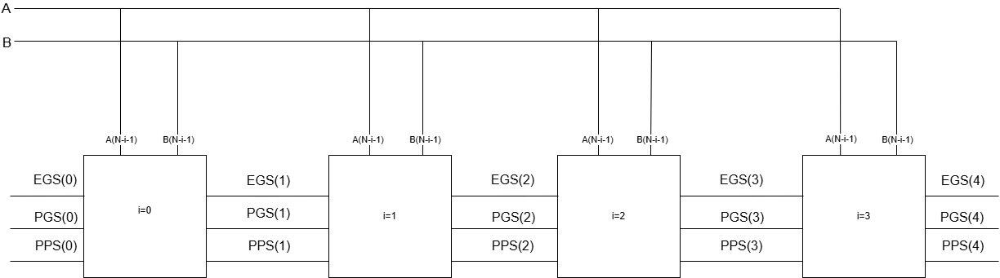

# Simple number comparison

In the following project I will show you how to make a number comparison with VHDL. There are easier ways to do it with some extension but I will do it the long way. I will also use Two's complement to represents positive and negative numbers with bits.

## Truth table and Karnaugh map

Before starting to write code we need to understand our problem. The truth table will give us all possible combinations of inputs and their associated outputs. This will allow us to make every possible Boolean expression for each output. This is inefficient because there might be multiple expressions that overlap. To simplify the logic we will also use a Kargnaugh map. You should also use static hazards to stop glitches while there is a transition between states.

These are the Boolean expressions I found with the truth table and Karnaugh map.

<b> Equal to: EGo =</b> `(not A and not B and not PPi and not PGi) or (A and B and not PPi and not PGi)`<br>
<b> Larger than : PGo = </b> `(PGi) or (A and not B and EGi) or (not A and B and not PPi and not EGi)`<br>
<b> Smaller than : PPo = </b> `(PPi) or (A and not B and not PGi and not EGi) or (not A and B and EGi)`

I won't explain everything but [i]=<b>(input)</b>, [o]=<b>(output)</b>. so When you see EGo mean the signal is going out and EGi means the signal is going in.

## VHDL

First we are going to call all libraries we are going to use in the VHDL file. here is the basic library I used.

```vhdl
library IEEE;
Use IEEE.std_logic_1164.all;
```

### entity

The entity area is where you will define all ports of my projects( inputs and outputs). I will also define how many bit they will have. Here is a little example.

```vhdl
entity comparer is
	port
	(
		A	: in std_logic;
		B	: in std_logic;
		PPi	: in std_logic;
		PGi	: in std_logic;
		EGi	: in std_logic;
		PPo	: out std_logic;
		PGo	: out std_logic;
		EGo	: out std_logic
	
	);
end comparer;
```

The `std_logic` means bits where the port has only 1 bit. Further down, I will show you how to define ports with multiple bits, also called a bus.

### architecture

The architecture is where you define how you want your entity to work. Here is where you insert your Boolean equations, you create signals and defines processes. Here is an example of my basic architecture for my comparer.

```vhdl
architecture combinational of comparer is
begin

	PPo <= (PPi) or (A and not B and not PGi and not EGi) or (not A and B and EGi);
	PGo <= (PGi) or (A and not B and EGi) or (not A and B and not PPi and not EGi);
	EGo <= (not A and not B and not PPi and not PGi) or (A and B and not PPi and not PGi);
end combinational;
```

After creating your VHDL file, compile it and create a testbench to check that it works the way you want it to. I will show you how to create a testbench in the future with ModelSim.

## Iterative circuit

Now that we have made sure our design work we encounter a problem.
It only allow us to compare 1 bit but, we need the process to repeat multiple times. Repeating the same process multiple times while using the outputs of the previous process. This is why we use signals like egi and ego etc. These signals will connect all the different stages of our iterative circuit together.

### Entity

Here is important information I added to my second VHDL file.

```vhdl
entity countbits is

    generic (N : integer :=4);
	
	port
	(
        A : in std_logic_vector(N-1 downto 0);
```

The <b>N</b> is a constant I will use to determine my number of bits for my inputs and the number of times to repeat the comparer VHDL architecture. `std_logic-vector` is what allows us to define a value with multiple bits. Values for [A] will go from A(3) to A(0), which is 4 bits in total. IT goes from the most significant bit (MSB) to least significant bit (LSB).

### Architecture

This architecture is a little bit more complex than the previous. I had to define signals to tell the system how to connect different inputs and outputs of standard cells. I will also have to tell the system to use comparer entity and how many times to use it. Here is an example of my signal creation

```vhdl
signal Egs : std_logic_vector(N downto 0);  
signal PPs : std_logic_vector(N downto 0);
signal PGs : std_logic_vector(N downto 0);
```

As you can see it is very similar to port but we do not define in or out. Then we will have to assign value to these signal. we can define signal with actual bits values or assigns ports to the signal. In my example I assigns all entry signals to the value '0' to represent the sign bits (the bits that define if the number is positive or negative)

```vhdl

    EGs(0) <= '0'; 
	PPs(0) <= '0'; 
	PGs(0) <= '0';
```

Now here is how I called my comparer entity 4 times and connected all the signals together.

```vhdl
cellsconnexion : for i in 0 to N-1 generate 
		ithConnexion : entity work.comparer port map 
		(		
			PPi => PPs(i),
         	PPo => PPs(i+1),
         	A   => A(N-1-i),

end gnerate;
```

I used a for loop to create my 4 standard cells starting from 0 to 3. Each will use my comparer entity (my one bit comparer). The port maps is where you connect ports of your inside entity to your current architecture signals.

why is ppi = i but ppo = i+1 ? standard cells are identified by the i value. let say we are talking about cells 0 and cells 1. the output of cell 0 (i+1) has connect to the input of cell 1 (i). Because they both have the same identifier (1) this ensure proper data flow between cells.

now we need to assign the outputs of cell 3 signals to entity countbits out ports.

```vhdl

    PGo <= PGs(N); 
	PPo <= PPs(N); 
	EGo <= EGs(N);
	
end iterative;
```

Here is how your design should look like<br>



# Conclusion

This small project was a great introduction to VHDL and the design process. If you have a physical fpga I would suggest to synthesize your VHDL code, configure pin assignment convert it to bitstream file and program your fpga.